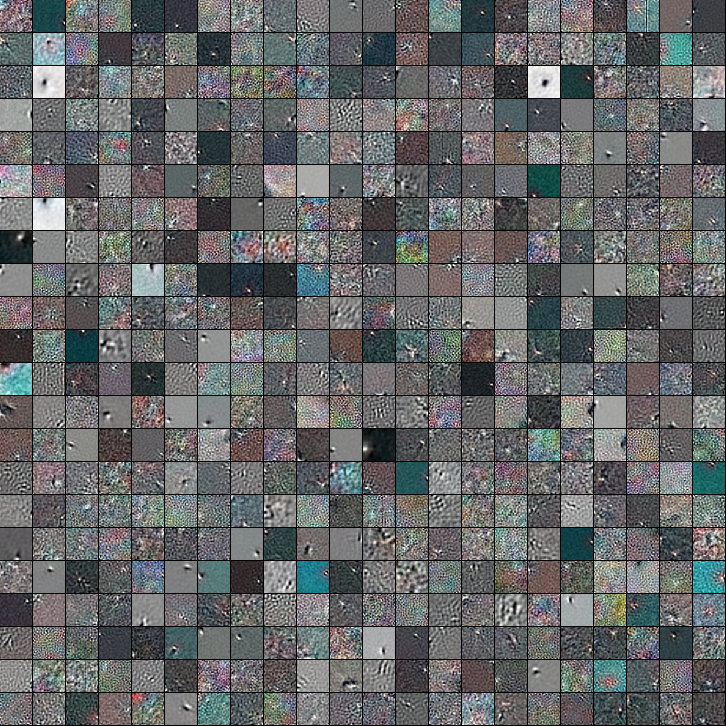
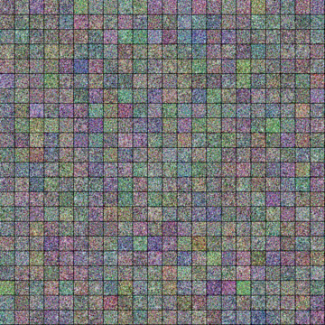
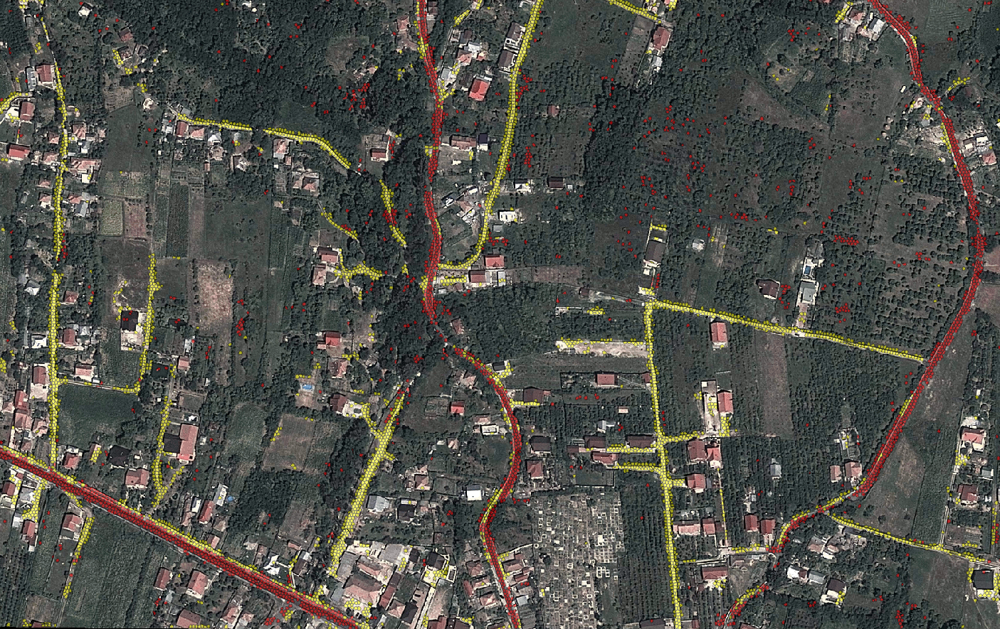

### DeepROADS

**Roads extraction from optical satellite imagery using Deep Belief Networks (DBN).**

|          GRBM INPUT          |              TIMELINE                 |
| ---------------------------- | ------------------------------------- |
|||



### About

This project extract and classifies roads in satellite imagery using superpixels and Deep Belief Networks.

The [network](/model) use the [deepnet](https://github.com/nitishsrivastava/deepnet) framework by [Nitish Srivastava](https://github.com/nitishsrivastava).

### Authors

 * **Balint Cristian** ```<cristian dot balint at gmail dot com>```
